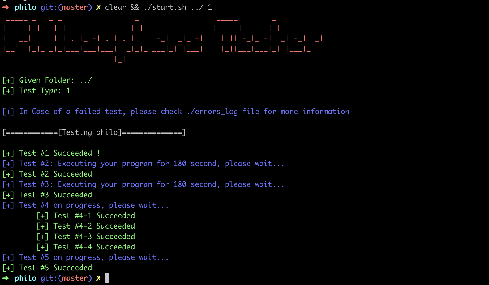

<h1 align="center">
	<ins>Philosophers</ins>
</h1>

## Proof of work

## Description

The Philosophers project is a collaborative effort within the 42 network that explores the synchronization problem in concurrent programming. The project is designed to implement the dining philosophers problem, a classic synchronization and concurrency challenge. It involves simulating a scenario where philosophers sit around a dining table, and they must share forks to eat their meals without causing deadlock or resource conflicts.

## Features

- Multi-threaded implementation of the dining philosophers problem.
- Visualization of the dining table and philosophers' activities.
- Adjustable parameters for the number of philosophers, simulation time, etc.

## Requirements

- C programming language
- POSIX threads
- Basic understanding of concurrency and synchronization concepts
